# Arquitectura de Ronin

Diagrama pedido en la revision docente del 2026-08-27 (ver `MAKERS_REVIEW.md`).
Muestra que parte del pipeline es deterministica, donde entra el LLM y donde se
verifica su salida.

```mermaid
flowchart LR
  DatosSesion["DatosSesion\n(export Health Auto Export)"] --> Ingesta
  Ingesta["Ingesta\nsrc/ingest/health_auto_export.py"] --> Anonimizacion
  Anonimizacion["Anonimizacion\nsrc/ingest/anonymize.py\n(sin lat/lon, sin id, t relativo)"] --> Segmentacion
  Segmentacion["Segmentacion\nsrc/segment/blocks.py\n(bloques de esfuerzo, deterministico)"] --> CalidadSeg
  CalidadSeg["CalidadSegmentacion\nsrc/segment/velocidad.py + calidad.py\n(patron, confianza, alerta)"] --> Metricas
  Metricas["Metricas\nsrc/metrics/session.py\n(degradacion, recuperacion, divergencia, historial)"] --> InterpretacionLLM
  InterpretacionLLM["InterpretacionLLM\nsrc/interpret/prototype.py\n(Groq, solo redacta)"] --> Verificacion
  Evals["Evals\nevals/eval_cases.json + run_evals.py"] --> Verificacion
  Verificacion["Verificacion\nsrc/verify/validate.py\n(cifras permitidas, requiere_revision)"]

  classDef deterministico fill:#dff5e1,stroke:#2f9e44,color:#1b1b1b;
  classDef llm fill:#fff3bf,stroke:#e8590c,color:#1b1b1b;
  classDef verifica fill:#e7e0ff,stroke:#5f3dc4,color:#1b1b1b;

  class Ingesta,Anonimizacion,Segmentacion,CalidadSeg,Metricas deterministico;
  class InterpretacionLLM llm;
  class Verificacion,Evals verifica;
```

## Que es deterministico

`Ingesta`, `Anonimizacion`, `Segmentacion`, `CalidadSegmentacion` y `Metricas`
son codigo, no modelo: detectan bloques de esfuerzo por umbral sobre FC maxima,
calculan degradacion del pico y recuperacion (HRR60), y comparan contra el
historial del jugador. El LLM nunca ve datos crudos ni calcula estos numeros.

`CalidadSegmentacion` decide cuanto confiar en la segmentacion. Ninguna de sus
partes cuenta sprints (ver el principio "Bloques, no sprints" del README):

- **Patron de la sesion** (`intermitente` / `continuo` / `sin_bloques`). Sale de
  la *forma* del esfuerzo, no de la velocidad: el numero efectivo de bloques,
  `(suma de duraciones)^2 / suma de duraciones^2`. Se lee como "cuantos
  esfuerzos distintos hubo" y es adimensional, asi que no depende de la
  velocidad del jugador ni de la duracion tipica del deporte. Un esfuerzo largo
  con un blip al lado sigue siendo un esfuerzo; veinte puntos cortos son veinte.
  El criterio (`round(...) >= 2`) es definicional, no una constante calibrada.
- **Correccion del inicio de cada bloque**, con velocidad. La FC tarda 15-30 s
  en subir, asi que cuando cruza el umbral el esfuerzo ya habia empezado. Si el
  jugador ya venia en movimiento, el inicio se adelanta (tope:
  `LATENCIA_FC_SEG`). Nunca cambia la cantidad de bloques, el pico ni la
  intensidad: en eso manda la FC.
- **Coincidencia FC-velocidad**: si los tramos mas rapidos *de esa misma sesion*
  (percentil, no un umbral fijo en km/h) caen dentro de los bloques de FC.

De ahi sale la confianza (`alta`/`media`/`baja`), que ademas baja si la serie
trae tramos reconstruidos por interpolacion. Cuando es `baja`, el sistema emite
la alerta `segmentacion_dudosa`.

**No hay ningun umbral absoluto de sprint, a proposito.** Uno fijo en km/h
penalizaria al jugador lento, y uno relativo a su propia velocidad maxima
invierte el resultado (correr es sostener velocidad; un partido es estar parado
con explosiones). El unico umbral de velocidad que queda es
`UMBRAL_MOVIMIENTO_KMH` (caminar vs trotar), y solo para refinar limites.

## Donde entra el LLM

`InterpretacionLLM` (Groq, `src/interpret/prototype.py`) recibe las metricas ya
calculadas y solo las traduce a lenguaje de cancha, cruza la nota subjetiva del
jugador y redacta la recomendacion de la semana. No inventa cifras ni
diagnostica.

## Donde se verifica

`Verificacion` (`src/verify/validate.py`) valida la entrada antes de correr el
pipeline (duracion minima, RPE en rango, cobertura de la serie) y, despues de
la respuesta del modelo, chequea que el texto no cite cifras que el sistema no
calculo (`verificar_cifras`). `Evals` (`evals/eval_cases.json` +
`evals/run_evals.py`) corre 5 casos contra esta misma cadena para confirmar que
el contrato se cumple (no inventar bloques sin datos, marcar incertidumbre,
resistir prompt injection, priorizar dolor).
